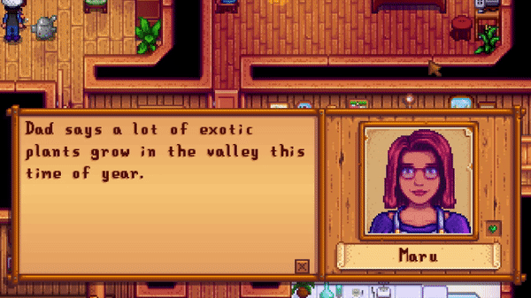

# R4sHearts

Replaces friendship jewels of dateable characters in Stardew Valley with Harvest Moon inspired hearts

## Background

I liked the idea of replacing the friendship indicator with hearts like in Harvest Moon.
However, only bachelors/bachelorettes have hearts in the original games (at least in DS, the part I played the most).
So I decided to make my own mod.

Because I am [probably not allowed to use Ran's assets](https://mayorfuu.tumblr.com/post/618280451343335424/blog-and-stardew-mods-update) and I'm too shy to ask, I had to do my own pixelart.
For a first time, this is not bad, I kinda like it how it turned out.
I tried to imitate the game's look as close as possible, meaning I used the same color palette and the light coming from the side. To highlight the difference between the purple and iridium, I copied the golden box.

## Usage

This works with all NPCs the game considers to be dateable (meaning also custom ones).
That means Krobus keeps his dot :(

Works with Stardew Valley 1.5.
Multiplayer is not tested as I no one to try out with but it should work in theory.

Obviously, this mod is not compatible with Ran's hearts.

## Install

Visual Studio automatically copies the mod into the game's Mods folder when hitting Build (Ctrl+Shift+B).
Alternatively, unpack the compiled zip into the mod folder by hand.

To uninstall it, simply remove it from the Mods folder.

### Dependencies

* Stardew Valley 
* [SMAPI](https://smapi.io/) (min. 3.0.0)
* .Net Framework 4.5.2

## Acknowledgements

Inspired by [Ran's Hearts](https://www.nexusmods.com/stardewvalley/mods/2846).

Big thanks to [Pathoschild](https://github.com/Pathoschild/) for providing the API and being a massive help on the [Stardew Valley Discord Server](https://discord.gg/stardewvalley). 

Special thanks to [ConcernedApe](https://twitter.com/ConcernedApe) for making [such a beautiful game](https://www.stardewvalley.net/).

Thank you for using this mod.

## Contributing

Feel free to contact me if you find bugs or have other issues. I'll try to fix them ASAP.

I made a rather minimal version to use for myself but I'm looking forward to suggestions.

## License

MIT © randomC0der
